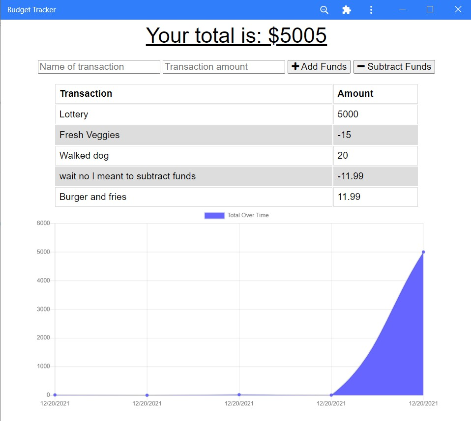

# Budget Tracker

## Description

This project is a progressive web application (PWA) for keeping track of your spending and saving habits.
It stores data remotely in a MongoDB Atlas cluster when online, using IndexedDB as buffer storage if the user loses connection while subitting a transaction.

## Contents

- [Installation](#installation)
- [Usage](#usage)
- [Credits](#credits)
- [License](#license)

## Installation

To install the most recent version of this project, navigate to its deployed Heroku page [here](https://exercise-tracker2021.herokuapp.com/). Once there, open your browser's settings in the top right (three dots for edge and Chrome, or 3 parallel lines in Mozilla) and select "Install budget tracker". The application is now installed locally on your computer.

If you wish to work with the source code, installation is slightly different. You'll need the following technologies:

- [Node.js](https://nodejs.org/en/)
- [MongoDB](https://docs.mongodb.com/manual/installation/)

Next, download the source code and navigate to the root folder in a CLI. Run `npm i` to install dependencies and `npm start` to run the program on `localhost:3001`. You can view database entries using the [mongo shell](https://docs.mongodb.com/mongodb-shell/install/#std-label-mdb-shell-install) or a GUI like [Robo 3T](https://robomongo.org/).

## Usage

To add transactions, enter the name of the transaction along with the amount it will subtract or add to your budget; next, press "add funds" or "subtract funds" to submit the name and amount.
Each transaction will then appear in a table below the form, along with a graph showing the grand total of all transactions.

## Questions

If you have any questions about using or contibuting to the project, you can contact me via email or though github:

- Email: jkohrt7@gmail.com
- Github: [@jkohrt7](https://github.com/jkohrt7)

## Credits

- [Chart.js ](https://www.chartjs.org/docs/latest/)

## License

[MIT](https://opensource.org/licenses/MIT)
